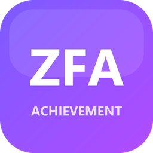
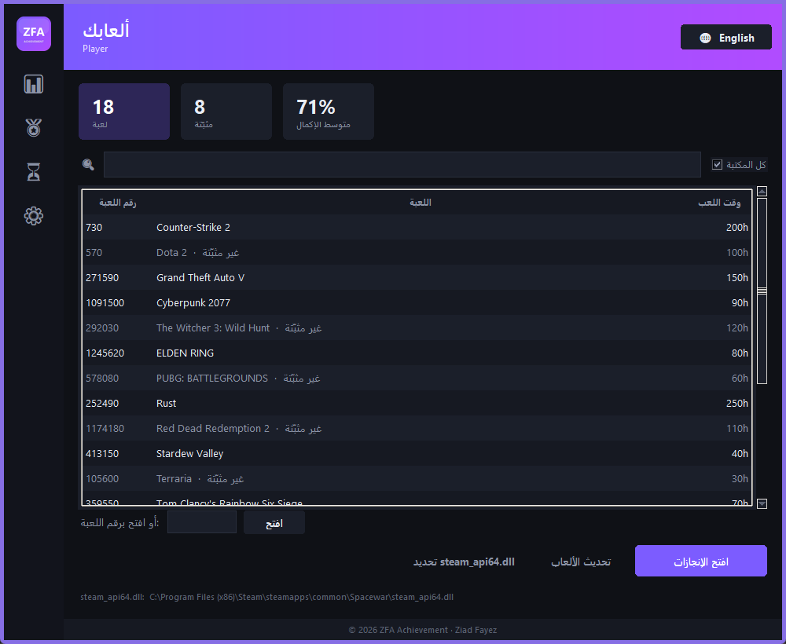
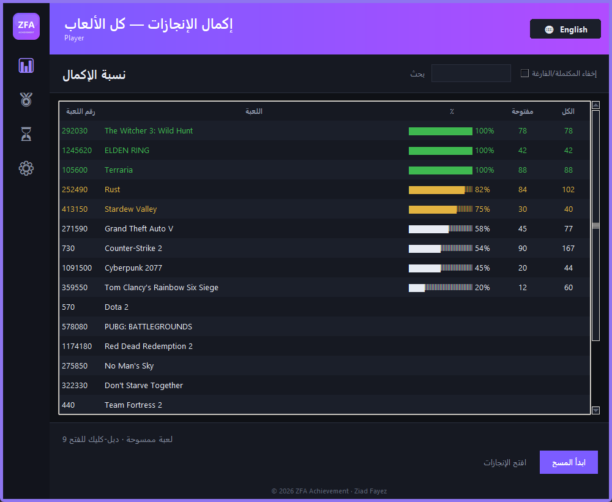
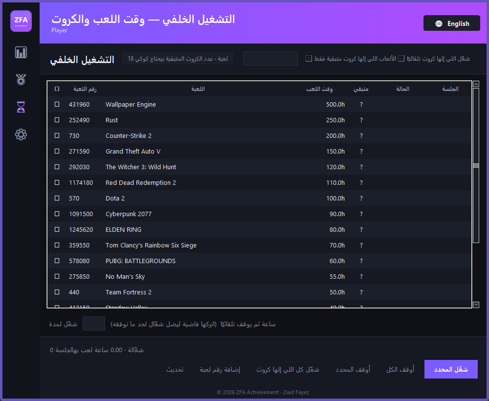
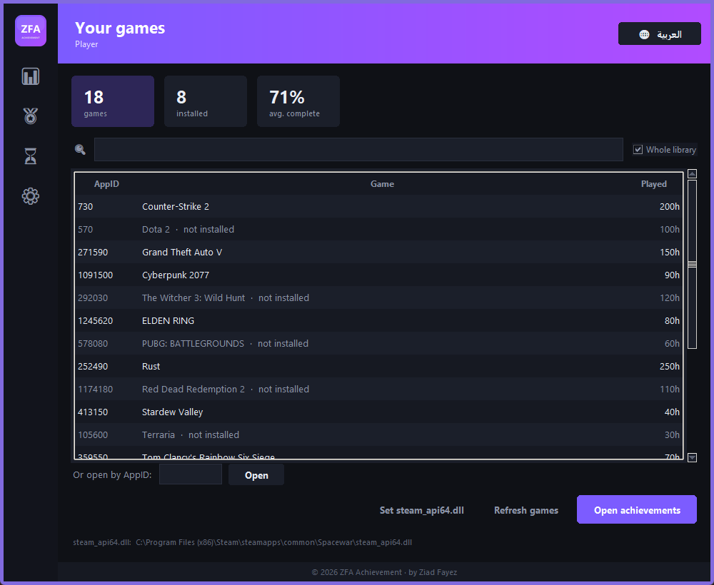

<div align="center">



# ZFA Achievement

**A modern, single-window desktop tool for managing Steam achievements, badge cards, and playtime — powered by the official Steamworks API.**

أداة سطح مكتب عصرية بنافذة واحدة لإدارة إنجازات Steam والكروت ووقت اللعب — عن طريق Steamworks API الرسمي.

[](https://github.com/abuzoz/ZFA-Achievement/releases/latest/download/ZFA-Achievement.zip)
&nbsp;
[](https://github.com/abuzoz/ZFA-Achievement/releases/latest)


**[English](#english)** · **[العربية](#العربية)**

<br />






</div>

---

## English

Everything lives in **one window** — the sidebar switches between internal pages instead of piling up separate popups. It talks to your Steam client through the **official Steamworks API**, the same way a real game does: no cracks, no patched game files.

### Features

| Page | What it does |
|------|--------------|
| 🎮 **Games** | Your whole library + stat cards + open a game's achievements |
| 📊 **Scan** | Completion % of every game's achievements, sorted, cached |
| 🏅 **Badges** | Your badges, the cards you're missing, and their market cost |
| ⏳ **Idler** | Make Steam count you as *playing* — for playtime **and** card drops, many games at once |
| ⚙ **Settings** | Language, profile URL, login cookie, start-with-Windows |

- **Whole library, installed or not.** Achievements, scanning, and the idler all work on any game on your account — it doesn't have to be installed.
- **Fully automatic.** It detects your Steam account, finds `steam_api64.dll`, and builds your library on first launch. No manual setup.
- **Bilingual.** Arabic and English, switched instantly with the 🌐 button. Arabic is shaped natively by Tk 8.6 — correct RTL, no scrambling.
- **Runs 24/7.** Close (X) minimizes to the system tray and keeps idling. Optional **start with Windows** resumes your idle jobs on boot.
- **No annoying errors.** Unexpected errors go to a log file, not a traceback popup. Games that refuse to launch are marked and skipped.
- **Safe editing.** Achievements can be staggered over time (looks natural) and a **backup is taken before every change** with one-click restore.

### Download & run

1. **[Download the latest release](https://github.com/abuzoz/ZFA-Achievement/releases/latest/download/ZFA-Achievement.zip)** and unzip it (keep the whole folder together).
2. Open **Steam** and sign in first.
3. Double-click the launcher shortcut (or `SteamAchievementManager.vbs`) — it opens with no console window.
4. Pick a game → **Open achievements**. That's it.

> **Windows may warn "protected your PC"** because the build is not signed with a paid certificate. Choose **More info → Run anyway**. If Smart App Control blocks the `.exe`, the included `.vbs` launcher runs it through your trusted Python instead.

**Run from source instead:**

```bash
pip install -r requirements.txt
python main.py
```

### The login cookie (optional)

Everything works without it. A `steamLoginSecure` cookie only unlocks three extras: **cards remaining**, in-progress badges, and **market prices** (Steam returns HTTP 429 for market requests without a login).

Add it in **⚙ Settings** — either the built-in **Import** button, or paste it manually (browser → `F12` → Application → Cookies → `steamLoginSecure`). It's stored **only on your machine** in `%APPDATA%\SteamAchievementManager\config.json`. Treat it like a password — don't share it.

### How it works

`steamapi.py` binds the Steamworks flat API via `ctypes`; `steamlib.py` discovers your Steam install, library, and account locally; `steamweb.py` reads Community pages (badges, card sets, prices) with rate-limiting. The UI is Tkinter with a dark indigo/violet theme centralized in [`theme.py`](theme.py). Each game's achievements open as an independent process, because Steamworks allows only one AppID per process.

### ⚠️ Disclaimer

Editing achievements violates the Terms of Service of some games and can remove you from leaderboards. It does **not** trigger a VAC ban, but **use is entirely at your own risk**. Badges are never force-unlocked — cards are real inventory items on Valve's servers with real prices; the only genuine ways to get them are the idler or the market.

---

<div align="right" dir="rtl">

## العربية

كل شي بنافذة **واحدة** — الشريط الجانبي بيبدّل بين الصفحات الداخلية بدل ما تتراكم نوافذ منفصلة. البرنامج بيحكي مع عميل Steam عن طريق **Steamworks API الرسمي**، بالضبط زي ما اللعبة نفسها بتعمل: ما في اختراق ولا تعديل على ملفات اللعبة.

### المميزات

| الصفحة | شو بتعمل |
|--------|----------|
| 🎮 **الألعاب** | مكتبتك كاملة + بطاقات إحصائيات + فتح إنجازات أي لعبة |
| 📊 **المسح** | نسبة إكمال الإنجازات لكل ألعابك، مرتّبة ومكاش |
| 🏅 **الشارات** | شاراتك، الكروت الناقصة، وتكلفتها من السوق |
| ⏳ **وقت اللعب** | تخلّي Steam يحسبك «بتلعب» — للوقت **وللكروت**، كذا لعبة بنفس الوقت |
| ⚙ **الإعدادات** | اللغة، رابط الحساب، الكوكي، التشغيل مع ويندوز |

- **كل مكتبتك، مثبّتة أو لأ.** الإنجازات والمسح والـ idler بيشتغلوا على أي لعبة بحسابك — مش لازم تكون منصّبة.
- **تلقائي بالكامل.** بيكتشف حساب Steam، بيلاقي `steam_api64.dll`، وبيبني مكتبتك بأول تشغيل. بدون أي إعداد يدوي.
- **بلغتين.** عربي وإنجليزي، بيتبدّلوا فورًا بزر 🌐. العربي بيتشكّل أصلًا من Tk 8.6 — RTL صحيح بدون تخريب.
- **بيشتغل 24/7.** زر الإغلاق (X) بينزّل البرنامج لجنب الساعة وبيكمّل تشغيل. وخيار **التشغيل مع ويندوز** بيرجّع مهامك أول ما يفتح الجهاز.
- **ما في رسائل خطأ مزعجة.** أي خطأ بينكتب بملف log مش بنافذة traceback. الألعاب اللي بترفض التشغيل بتتعلّم وبتنتخطّى.
- **تعديل آمن.** الإنجازات بتتوزّع على فترة (بيبيّن طبيعي)، و**بتتاخد نسخة احتياطية قبل أي تعديل** مع استرجاع بضغطة.

### التحميل والتشغيل

1. **[نزّل آخر إصدار](https://github.com/abuzoz/ZFA-Achievement/releases/latest/download/ZFA-Achievement.zip)** وفك الضغط (خلي المجلد كامل مع بعض).
2. افتح **Steam** وسجّل دخول أول.
3. دبل-كليك على اختصار المشغّل (أو `SteamAchievementManager.vbs`) — بيفتح بدون نافذة كونسول.
4. اختر لعبة → **افتح الإنجازات**. خلص.

> **ممكن ويندوز يقول «Windows protected your PC»** لأن البرنامج غير موقّع بشهادة مدفوعة. اضغط **More info → Run anyway**. ولو Smart App Control حظر الـ `.exe`، المشغّل `.vbs` بيشغّله عبر بايثون الموثوق عندك.

**تشغيل من المصدر:**

```bash
pip install -r requirements.txt
python main.py
```

### كوكي تسجيل الدخول (اختياري)

كل شي بيشتغل بدونه. كوكي `steamLoginSecure` بس بيفتح ثلاث إضافات: **عدد الكروت المتبقية**، الشارات قيد التقدم، و**أسعار السوق** (Steam بيرجّع 429 لأي طلب سوق بدون تسجيل دخول).

حطّه من **⚙ الإعدادات** — إما زر **استيراد** الجاهز، أو الصقه يدويًا (المتصفح → `F12` → Application → Cookies → `steamLoginSecure`). بينحفظ **على جهازك بس** في `%APPDATA%\SteamAchievementManager\config.json`. عامله زي كلمة السر — لا تشاركه.

### ⚠️ إخلاء مسؤولية

تعديل الإنجازات مخالف لشروط بعض الألعاب وممكن يشيلك من لوحات المتصدرين. **ما بيسبب حظر VAC**، بس **الاستخدام على مسؤوليتك الكاملة**. الشارات ما بتنفتح بالقوّة — الكروت أغراض جرد حقيقية على سيرفرات Valve إلها أسعار، والطريقتين الوحيدتين الحقيقيتين: الـ idler أو السوق.

</div>

---

<div align="center">

© 2026 ZFA Achievement · by **Ziad Fayez** · [MIT License](LICENSE)

</div>
